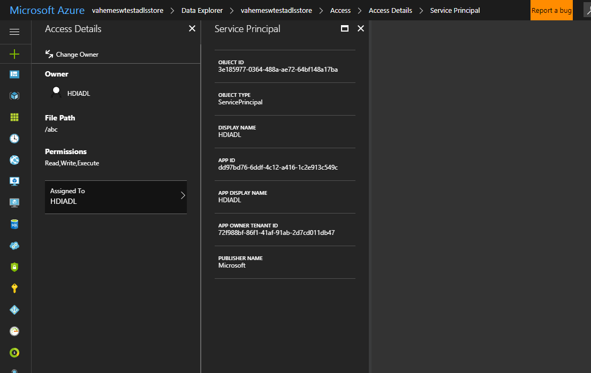

### How to re-use existing container when creating clusters with DataLake as primary storage

When creating clusters with DataLake as primary storage, a container is configured under which all the cluster-specific files will be stored. For instance, if the user specifies root path for a cluster as ‘/Clusters/clustername’, ‘clustername’ is the container.

User may choose to use a new container or re-use an existing one. Re-using the container is only possible when the old cluster that was using the container is deleted. When re-using the cluster container, user may specify the same service principal that was used to create the container initially or a new service principal.

- Using same service principal
       - If the same service principal is used, no issues should be encountered if there are no changes to the owning user of the files underneath the container.
       - In case owner of one or more files is changed, set the service principal as owner of those files. This can be done via Azure portal using the 'Change Owner' option.
       
       - In some cases, an old service principal is deleted and new one with the same name may have been created. Confirm if this is the case by verifying the App ID and Object ID of the service principal that is the owner of files in the container from the portal with the service principal that is being used for cluster creation.
       If the IDs are indeed different follow the steps from the following section to configure appropriate owner.

- Using a new service principal
       - Using a new service principal with existing container requires some setup in addition to the permission setup specified [here](adls-create-permission-setup.md) for the cluster creation to succeed.
       - This requires changing the owner of all files and folders under the container to the new Service principal(can be done through Azure portal).
       - Alternatively, use [this](https://github.com/Azure/AzureDataLake/blob/master/Samples/PowerShell/ADLSUser/Set-AdlsAccess.ps1) PowerShell script to recursively change owner for all files/folders in container.
       - This is mandatory because, during the container setup, some permissions are set on the files in the container and only the owner of the file can set these permissions.
       - The container would have the old service principal as the owner and this restricts the new service principal to set required permissions.

#### Possible errors:

Cluster creation fails with *InsufficientPermissionsToCopyBlobsToDataLakeContainerErrorCode* due to insufficient privileges for the new serviceprincipal to change permissions on adls files/folders error if the container is not setup with proper owner.

#### Alternative options:

- Change root path to use another container, say - ‘/Clusters/AnotherClusterContainer’
- If you do not want to change the root folder
       - Delete the existing container and try cluster creation again. This will create the container with files underneath having new service principal as the owner or
       - Add the new service principal as owner of storage account. This gives the new service principal superuser privileges for the storage account and cluster creation should succeed(Recommended only as temporary and quick work around because the step means elevation of privileges for the service principal over the storage account itself).