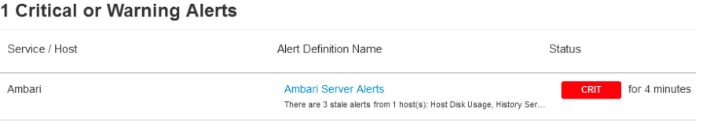

## **Issue Description / Symptoms**

Users see stale alerts in Ambari. See below image as an example

### **Ambari stale alerts**
Ambari agents run a lot of alerts to monitor the health of many resources. Each alert is configured to run at predefined interval of time. After execution of each alert, ambari agents report back the status of the alert to the ambari server. At this point if ambari server detects that any of the alerts were not run in a timely manner, then it triggers a "Ambari Server Alerts".

### **Potential Causes**
1) When hosts are under heavy utilization (high CPU), there is a possibility that Ambari Agent was not able get enough sytem resources to execute the alerts in timely manner.
2) The cluster is busy executing many jobs/services during heavy load
3) Few hosts in the cluster may host many components and hence will be be required to run many alerts. If the number of components is large, it is possible that alert jobs may miss their scheduled intervals

Determine the below
1) Which alert(s) were not able to execute in timely manner
2) On which Host(s) did these stale alerts were triggered
3) Time at which these stale alerts were triggered 

### **Potential Mitigations**

**Increate alert interval time**
You can choose to increase the value of an individual alert interval based on the response time of your cluster and its load.

1) Go to Alerts tab on the Ambari UI
2) select appropriate group for the alert or select "All"
3) Search for an alert by its definition name
4) Click on the right alert definition name 
5) You will be taken to the corresponding alert definiton page. 
6) Click "Edit" link 
7) Increase the interval value of the alert
8) Click save

**Increate alert interval time for *Ambari Server Alerts***

1) Go to Alerts tab on the Ambari UI
2) select "AMBARI Default" group
3) Click on the alert definiton name "Ambari Server Alerts" 
4) You will be taken to the alert definiton page. 
5) Click "Edit" link 
6) Increase the interval value of the alert
7) Also if needed increate the "Interval Multipler" (A value used for calculating staleness of an alert). 
8) Click save

**Diable and Enable the alert**
You can Disable and then again Enable the alert to discard any stale alerts

1) Go to Alerts tab on the Ambari UI
2) select appropriate group for the alert or select "All"
3) Search for an alert by its definition name
4) Click on the right alert definition name 
5) You will be taken to the corresponding alert definiton page. 
6) Click "Enabled" link - A pop up will be shown to confirm Disbaling of the alert. Click "Confim Disable"
7) Wait for few seconds to for all the alert "Instances" shown on the page are cleared
8) Click "Disabled" link - A pop up will be shown to confirm Enabling of the alert. Click "Confirm Enable"

**Increate alert grace time**
Before Ambari agent reports that an configured alert missed its schedule, there is a grace time applied. Even if the alert missed its scheduled time but was triggered within the alert grace time, then stale alert is not fired.

The default alert_grace_period value is 5 second. This alert_grace_period setting is configurable in /etc/ambari-agent/conf/ambari-agent.ini. For those hosts from which the stale alerts are fired at regular intervals, try to increase to a value of 10. And restart the ambari agent

