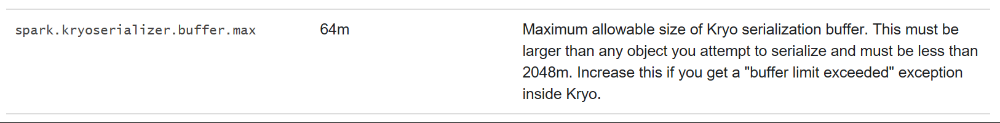

### Why do I see Spark Exception stating Kyro Serialization failed, similar to the one below, when trying to download/ retrieve a large data via JDBC/ODBC using Thrift Server. This issue is most likely observed on clusters using spark version  2.0.0 or earlier.

~~~~
 org.apache.spark.SparkException: Kryo serialization failed:
 Buffer overflow. Available: 0, required: 36518. To avoid this, increase spark.kryoserializer.buffer.max value.
~~~~

#### Kyro is a Object Graph Serialization framework for Java, similar to Apache Avro or Google's Protobuf.
#### We usually start making changes to the spark.kyroserializer.buffer.max, somewhere in one of the spark versions its clearly documented the maximum value that you can set  is 2048m.

### More Information:

In Spark 2.0.0 org.apache.spark.serializer.JavaSerializer Class is used for serializing objects that will be sent over the network or need to be cached in serialized form. org.apache.spark.serializer.KryoSerializer is used when data is accessed over  Spark SQL Thrift Server.
So with Spark 2.0.0 Kyroserializer is the default serializer used during data access over Spark SQL Thrift Server

It is certainly recommend using org.apache.spark.serializer.KryoSerializer when speed is necessary.
Refer spark.serializer under  http://spark.apache.org/docs/2.0.0/configuration.html#compression-and-serialization

Whereas with Spark 2.1.0  Spark SQL Thrift Server is also configured to use org.apache.spark.serializer.JavaSerializer Class as the default for any Serializable Java object.
Refer spark.serializer under http://spark.apache.org/docs/2.1.0/configuration.html#compression-and-serialization

https://issues.apache.org/jira/browse/SPARK-17350 this talks about disabling kryo serialization as default serializer in thrift server to improve performance.

### Resolution:
Spark has changed the default serialization to Javaserializer in 2.1.0 and latest version.
Above mentioned  issue can be resolved my using HDInsight 3.6 clusters which hosts  hadoop 2.1.0 where Javaserializer is used for data access over Spark SQL thrift Server