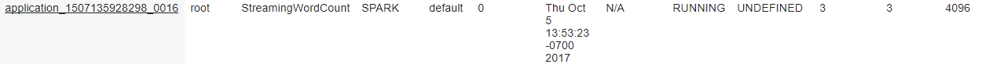
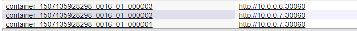

### Troubleshooting YARN application starts with YARNUI and the next steps is to analyze the YARN logs to determine any Perfomance issues or Failures.

While YARN is well documented [here](https://hortonworks.com/blog/apache-hadoop-yarn-concepts-and-applications/)
This article starts by with a gist on YARN Concepts, how YARN components are represented on YARN UI.

ResourceManager (RM) : ResourceManager consolidates resources for the cluster and is responsible for scheduling and allocation of cluster resources to applications.

ApplicationMaster (AM) : Negotiate resources from Resource Manager, Work with NodeManger(s) to track and monitor the applications.

Containers : Represents a resource (Memory & Cores) on a single node of a cluster. All YARN Applications are processed within a Container. Application Master in case of YARN; Spark Driver and Executors all have their own containers. 

NodeManager (NM) : All workernodes on our clusters has a Node Manager daemon, NM updates the Resource Manager on the resource capacity (Memory & Cores) .

### Spark Driver, Executors and Tasks
Driver: A Spark Driver is a JVM process that hosts SparkContext for a Spark Application.
Executors: Executors are the actual JVMs spawned on the workernode. Number of executors is managed by Spark, which is configurable when submitting a job.
Tasks: Executor run many tasks in parallel, each task is run as a process thread in executor JVM. Tasks from different applications run in different JVM.
Note: Number of tasks spawned depends on the number of partitions in your RDD. coalesce and repartitions drive the parallelism that we suggest when troublehsooting performanc issues.

#### How these entities are represented on the YARN UI

 
    