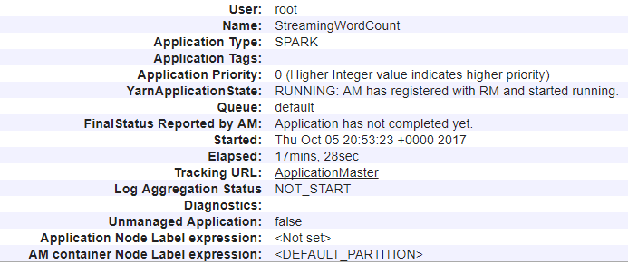

## Troubleshooting YARN application starts with YARNUI and the next steps is to analyze the YARN logs to determine any Perfomance issues or Failures.

While YARN is well documented [here](https://hortonworks.com/blog/apache-hadoop-yarn-concepts-and-applications/)
This article starts by with a gist on YARN Concepts, how YARN components are represented on YARN UI.

ResourceManager (RM) : ResourceManager consolidates resources for the cluster and is responsible for scheduling and allocation of cluster resources to applications.

ApplicationMaster (AM) : Negotiate resources from Resource Manager, Work with NodeManger(s) to track and monitor the applications.

Containers : Represents a resource (Memory & Cores) on a single node of a cluster. All YARN Applications are processed within a Container. Application Master in case of YARN; Spark Driver and Executors all have their own containers. 

NodeManager (NM) : All workernodes on our clusters has a Node Manager daemon, NM updates the Resource Manager on the resource capacity (Memory & Cores) .

### Spark Driver, Executors and Tasks
##### Driver: A Spark Driver is a JVM process that hosts SparkContext for a Spark Application.
##### Executors: Executors are the actual JVMs spawned on the workernode. Number of executors is managed by Spark, which is configurable when submitting a job.
##### Tasks: Executor run many tasks in parallel, each task is run as a process thread in executor JVM. Tasks from different applications run in different JVM.
Note: Number of tasks spawned depends on the number of partitions in your RDD. coalesce and repartitions drive the parallelism that we suggest when troublehsooting performanc issues.

### How are these entities are represented on the YARN UI
##### What's in a Name? YARN Application ID 
When you launch your YARNUI, using the URL https://{clusterName}.azurehdinsight.net/YARNUI you will find list of applications in different states. Lets start with YARN Application ID, YARN applicationID (application_RM-Start-Time_RunningNumber) represents the time when RM started and the count of Jobs. Following is a screenshot of just one Application.

##### Note: For all the YARN application Issues (Performance, Failure, Application not launching), this is the first place to start.
###### Look for the starttime, Finishtime State and the number of containers.

Selecting the YARN Application ID redirects the request the Appliation Master details page.

###### Lookup for the YARNApplication state: Attempt display below is the Application Master this Job

A list Application Master is display here, you will find only one entry for AM attempt.
AM Attempt ID (attempt_RM-Start-Time_RunningNumber_000001) represents the time when RM started and the count of Jobs.
Recall Application Master is the main container requesting, launching and monitoring application specific resources.

###### Application Master is the first container that gets lauched when the job is accepted and always ends with 000001

Select the Attempt ID hyper link to discplay the container that hosts this Application Master.
Look up for AM container which starts with Container_ApplicationId_attemptID_containerID

 
    
