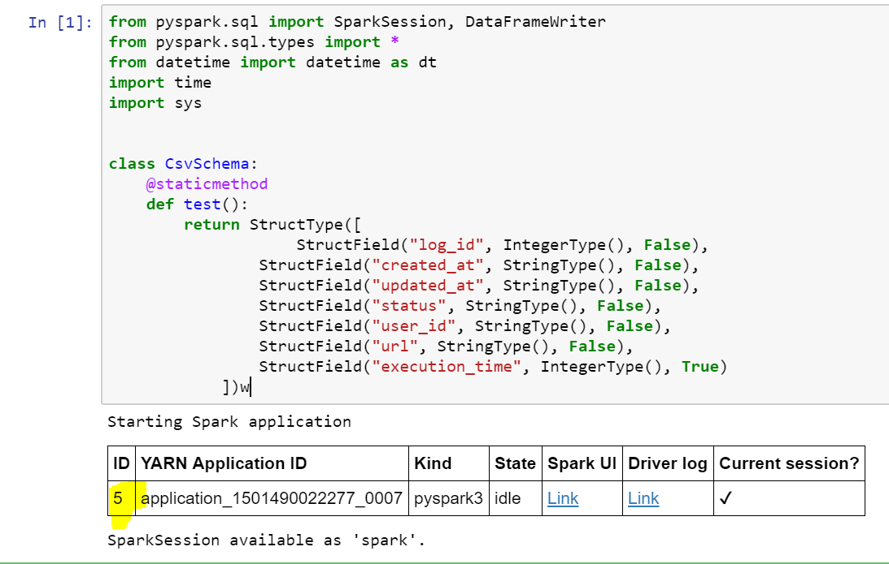

#### Learn how to retrieve livy session details, important step in isolating issue when submitting jobs from jupyter.
##### Scenario: Executing pyscript to load a large CSV files using Jupyter.
##### Issue: Spark UI shows that the target job has completed but on the Jupyter kernel states is shown as busy and that process will not get completed.
##### Seems like Spark UI shows the job completed but Jupyter Notebook doesn't receive any response.

First step would be to identify the livy Session ID.

Refer the image above, highlighted number would be the livy Session ID.
You can retrieve the livy session details by a forming the below URL.
##### https://`<`clusterName`>`.azurehdinsight.net/livy/sessions/`<`ID`>`/statements
##### Replace clusterName field with your clustername and then <ID> field with the number that was return when the Spark Session got created.

I could access the livy session created on my cluster by browsing to https://kcsparkxyz.azurehdinsight.net/livy/sessions/5/statements

~~~~
/ 20170803162406
// https://kcsparkxyz.azurehdinsight.net/livy/sessions/5/statements

{
  "total_statements": 3,
  "statements": [
    {
      "id": 0,
      "state": "available",
      "output": {
        "status": "ok",
        "execution_count": 0,
        "data": {
          "text/plain": "<pyspark.sql.session.SparkSession object at 0x7f8bd3f000f0>"
        }
      }
    },
    {
      "id": 2,
      "state": "available",
      "output": {
        "status": "ok",
        "execution_count": 1,
        "data": {
          "text/plain": ">>> START   : 2017/08/03 23:23:54"
        }
      }
    }
  ]
}
~~~~
