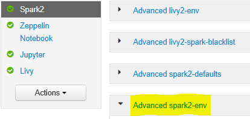

# Azure HDInsight Solutions | Apache Spark | Spark History server OutOfMemoryError

## Scenario: java.lang.OutOfMemoryError: Java heap space error when we trying to open spark history server 

## Issue

You receive the following error when opening events in Spark History server:

```java
scala.MatchError: java.lang.OutOfMemoryError: Java heap space (of class java.lang.OutOfMemoryError)
```

## Cause

This issue is often caused by a lack of resources when opening large spark-event files. The Spark heap size is set to 1 GB by default, but large Spark event files may require more than this.

If you would like to verify the size of the files that you are trying to load you can perform the following commands:

```bash
hadoop fs -du -s -h wasb:///hdp/spark2-events/application_1503957839788_0274_1/
**576.5 M**  wasb:///hdp/spark2-events/application_1503957839788_0274_1

hadoop fs -du -s -h wasb:///hdp/spark2-events/application_1503957839788_0264_1/
**2.1 G**  wasb:///hdp/spark2-events/application_1503957839788_0264_1
```

## Solution

You can increase the Spark History Server memory by editing the `SPARK_DAEMON_MEMORY` property in the Spark configuration and restarting all the services.

You can do this from within the Ambari browser UI by selecting the Spark2/Config/Advanced spark2-env section.



Add the following property to change the Spark History Server memory from 1g to 4g:

`SPARK_DAEMON_MEMORY=4g`


Make sure to restart all affected services from Ambari.