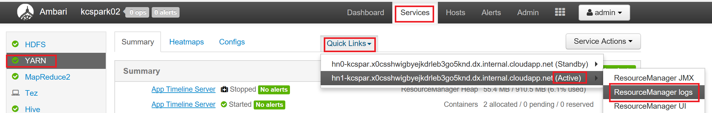

####This article helps as reference with the list of log files for the all the cluster type Hadoop, HBase, Storm, Spark hosted on HDinsight.

On HDInsight clusters the Client application, Services component and the Workload services process information in individual log files.
You can use the information in these log files to help you troubleshoot issues that might occur while processing your data

The following sections provide details about the different log files. Use this information to view and monitor client and server logs for operation details and identify error information that might help you to troubleshoot any problems.

Ambari :
Ambari Server and Agent logs are stored on the Head Node.
SSH to the active Headnode to find.

>Ambari Server logs at /var/log/ambari-server/ambari-server.log

>Ambari Agent logs  at /var/log/ambari-agent/ambari-agent.log .

YARN : Resource Manager and Node Manager log files

If an error occurs at the YARN level, you might have to examine the log files for the Resource Manager and Node Managers.
These files are on the computers that host the Resource Manager and each Node Manager.

> Application Master Logs
The Application Master requests resources from Resource Manager and runs job processes on the allocated resources

> Resource Manager Logs
>> Contains information on Resource Manager Health, Application State and their Transitions
>> RM logs will also resource requests for containers from Application Master.

For instance I had requested more cores than permitted and the job failed to execute this entry can be found in RM Logs
~~~~
org.apache.hadoop.yarn.exceptions.InvalidResourceRequestException: Invalid resource request, requested virtual cores < 0, or requested virtual cores > max configured, requestedVirtualCores=8, maxVirtualCores=7
	at org.apache.hadoop.yarn.server.resourcemanager.scheduler.SchedulerUtils.validateResourceRequest(SchedulerUtils.java:274)
	at org.apache.hadoop.yarn.server.resourcemanager.scheduler.SchedulerUtils.normalizeAndValidateRequest(SchedulerUtils.java:234)
~~~~
SSH
Login to the active Headnode and download the logs from "/var/log/hadoop-yarn/yarn"

Ambari UI
To download ResourceManger from Ambari UI browse to https://clusterName.azurehdinsight.net/#/main/dashboard/metrics.

Services -> YARN -> QuicksLink -> Choose the Resource Manager Logs from the Active headnode.

> Node Manager Logs
 NM Logs
You would usually check the RM logs first. From RM log, you can determine which Node Manager logs to check

From the SSH connection to the head or edge node, use the ssh command to connect to a worker node in the cluster:
~~~~
ssh sshuser@wn0-kcspar
~~~~

To find the NM logs under "/var/log/hadoop-yarn/yarn"

~~~~
sshuser@wn0-kcspar:/var/log/hadoop-yarn/yarn$ ls -l
total 184
-rw-r--r-- 1 yarn hadoop 183538 Jul 31 06:48 yarn-yarn-nodemanager-wn0-kcspar.log
-rw-r--r-- 1 yarn hadoop   2884 Jul 30 22:01 yarn-yarn-nodemanager-wn0-kcspar.out
~~~~

>ThriftServer:

Tools like Power BI, Tableau etc. use ODBC protocol to communicate with Spark Thrift Server to execute Spark SQL queries as a Spark Application
From the SSH connection to the head, browse to /var/log/spark to find sparkthriftdriver.log
~~~~
sshuser@hn0-kcspar:/var/log/spark$ ls -l
total 184
-rw-r--r-- 1 hive hadoop 183924 Jul 31 07:51 sparkthriftdriver.log
~~~~