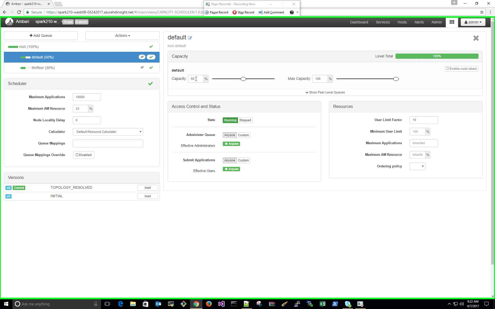
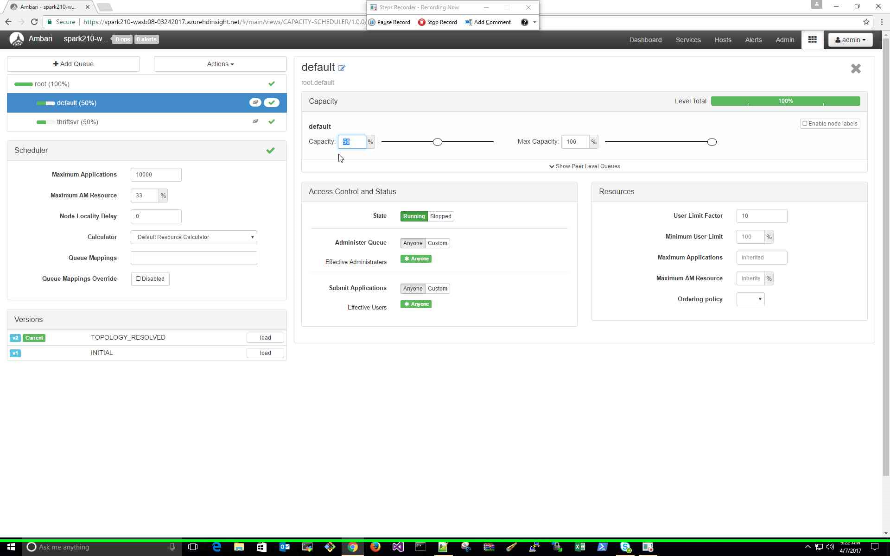
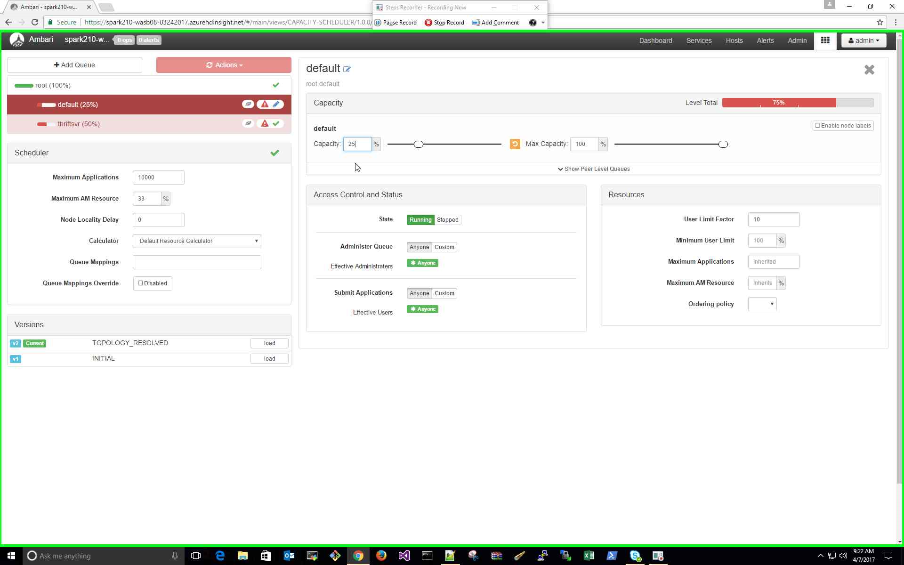
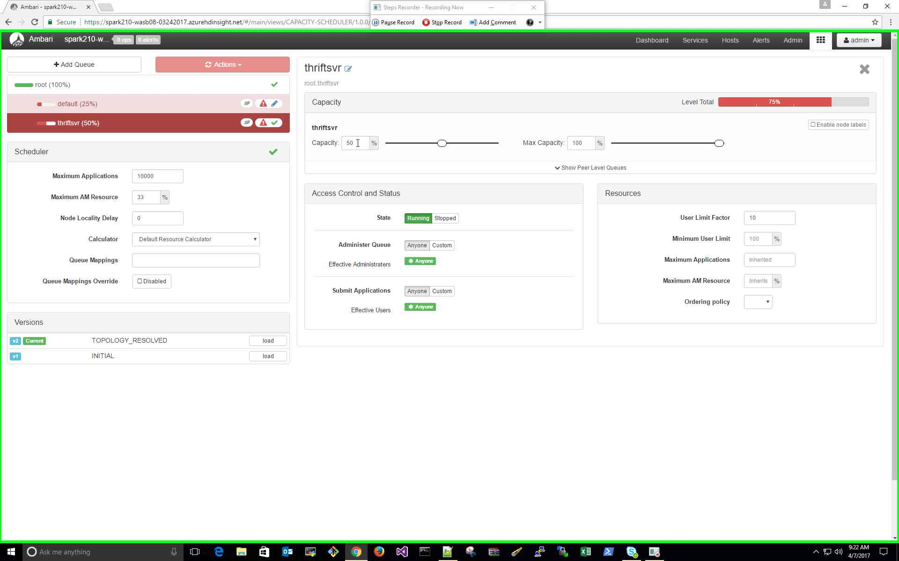
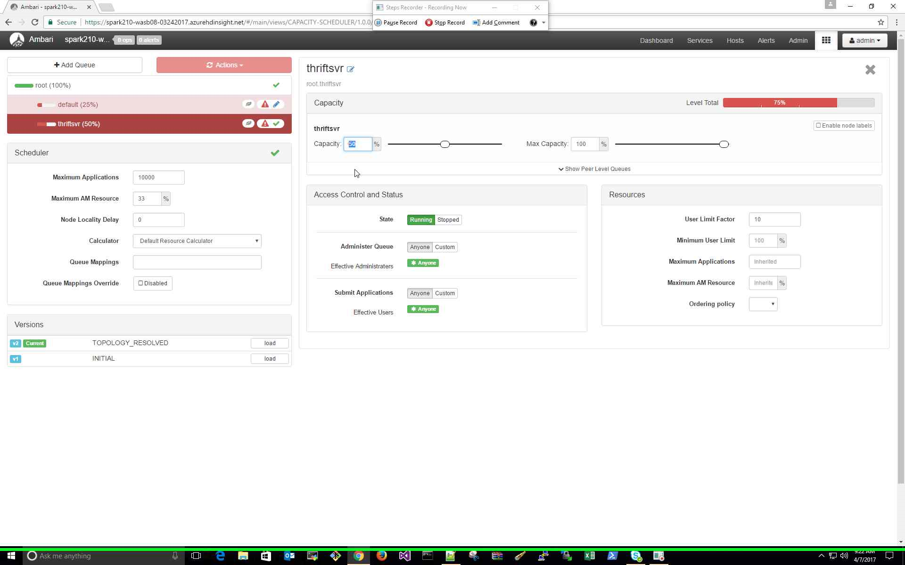
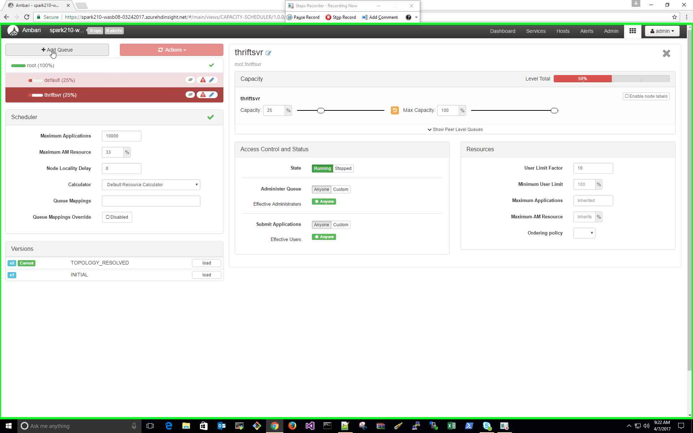
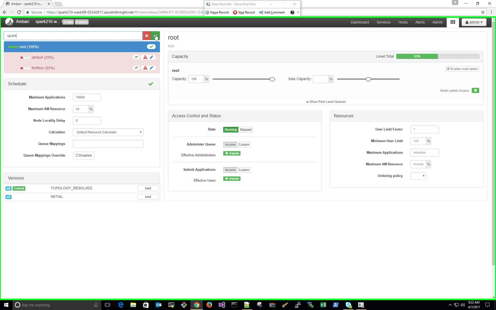
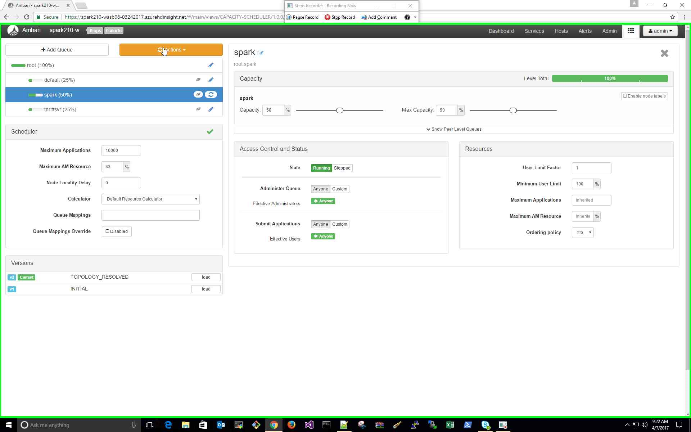
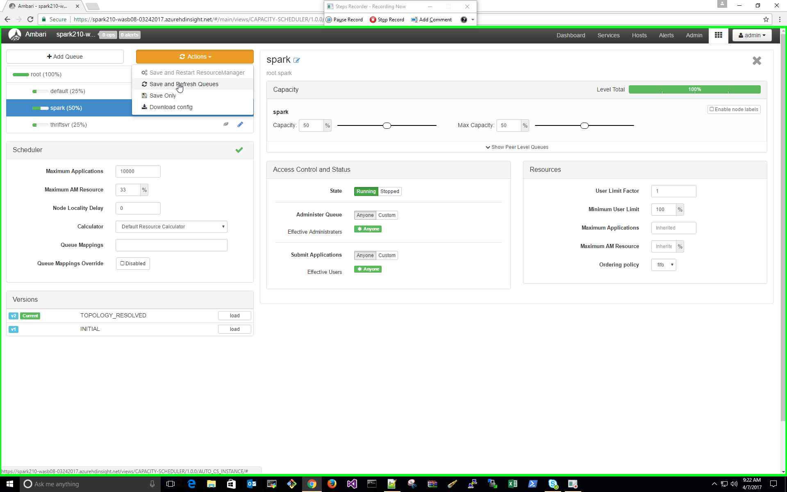
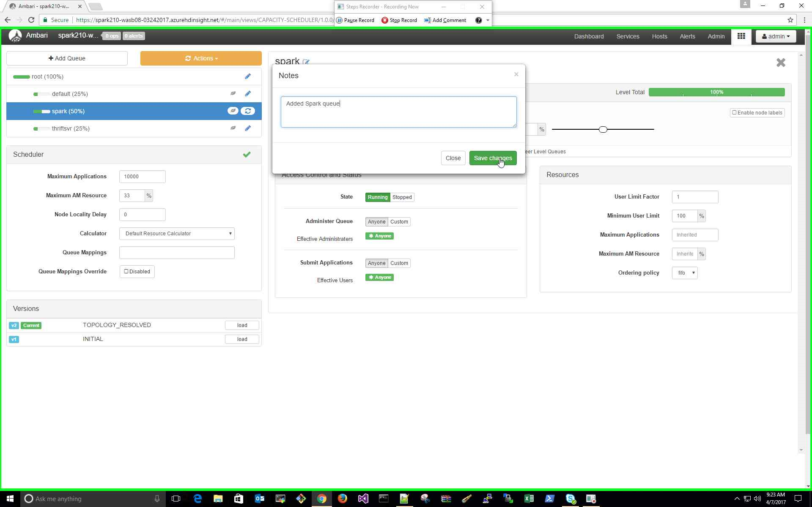

### How do I create new Yarn queue on HDInsight cluster?

#### Issue:

Need to create a new Yarn queue with capacity allocation on HDInsight cluster.  

#### Resolution Steps: 

1. Use the following steps through Amabari to create a new Yarn queue and balance the capacity allocation 
among all the queues.

Note: These changes will be visible immediately on the Yarn Scheduler UI.

#### Further Reading:

1) [Yarn Capacity Scheduler](https://hadoop.apache.org/docs/r2.7.2/hadoop-yarn/hadoop-yarn-site/CapacityScheduler.html)
